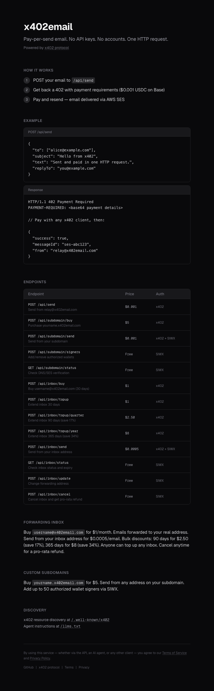

# x402email

Pay-per-send email over [x402](https://www.x402.org/). No API keys. No accounts. Fund a wallet, send email.

**[x402email.com](https://x402email.com)**



## Why

Every email API requires signup, API keys, billing accounts, and rate limit negotiations. x402email replaces all of that with a single HTTP request and a micropayment. Any x402-compatible client (wallets, AI agents, scripts) can send email programmatically with zero setup.

## Three Tiers

**Shared domain** — Send from `relay@x402email.com` for **$0.001/email**. No auth, just pay. Good for notifications, alerts, one-off sends.

**Forwarding inbox** — Buy `username@x402email.com` for **$1/month**. Emails forwarded to your real address. Send from your inbox address for $0.001/email. Bulk discounts: 90 days for $2.50 (save 17%), 365 days for $8 (save 34%). Anyone can top up any inbox. Cancel anytime for a pro-rata refund.

**Custom subdomain** — Buy `yourname.x402email.com` for **$5**. Send from `anything@yourname.x402email.com` with full DKIM/SPF/DMARC. Wallet-based auth (SIWX) proves ownership. Up to 50 authorized signer wallets. $0.001/send.

## How It Works

```
Client                          x402email                        AWS SES
  |                                  |                              |
  |-- POST /api/send --------------->|                              |
  |<-- 402 + payment details --------|                              |
  |                                  |                              |
  |-- POST /api/send --------------->|                              |
  |   + x402 payment header          |-- SendEmail ---------------->|
  |<-- { success, messageId } -------|<-- messageId ----------------|
```

x402 handles payment negotiation automatically. Compatible clients resolve the 402 -> pay -> retry flow transparently.

## API

### Shared domain

| Endpoint | Protection | Cost | Description |
|----------|-----------|------|-------------|
| `POST /api/send` | x402 | $0.001 | Send from `relay@x402email.com` |

### Forwarding inbox

| Endpoint | Protection | Cost | Description |
|----------|-----------|------|-------------|
| `POST /api/inbox/buy` | x402 | $1 | Buy `username@x402email.com` (30 days) |
| `POST /api/inbox/topup` | x402 | $1 | Extend inbox 30 days |
| `POST /api/inbox/topup/quarter` | x402 | $2.50 | Extend inbox 90 days (save 17%) |
| `POST /api/inbox/topup/year` | x402 | $8 | Extend inbox 365 days (save 34%) |
| `POST /api/inbox/send` | x402 | $0.001 | Send from your inbox address |
| `GET /api/inbox/status` | SIWX | Free | Check inbox status and expiry |
| `POST /api/inbox/update` | SIWX | Free | Change forwarding address |
| `POST /api/inbox/cancel` | SIWX | Free | Cancel inbox, pro-rata refund |

### Custom subdomain

| Endpoint | Protection | Cost | Description |
|----------|-----------|------|-------------|
| `POST /api/subdomain/buy` | x402 | $5 | Purchase `yourname.x402email.com` |
| `POST /api/subdomain/send` | x402 | $0.001 | Send from your subdomain |
| `POST /api/subdomain/signers` | SIWX | Free | Add/remove authorized wallets |
| `GET /api/subdomain/status` | SIWX | Free | Check DNS/SES verification |

### Discovery

| Endpoint | Protection | Description |
|----------|-----------|-------------|
| `GET /.well-known/x402` | Public | x402 resource discovery (pricing + schemas) |
| `GET /llms.txt` | Public | Agent integration instructions |

### Send an email

```bash
curl -X POST https://x402email.com/api/send \
  -H "Content-Type: application/json" \
  -d '{
    "to": ["alice@example.com"],
    "subject": "Hello from x402",
    "text": "Sent with a micropayment, not an API key.",
    "replyTo": "you@example.com"
  }'
# Returns 402 -> client pays $0.001 USDC on Base -> email sends
```

### Buy a forwarding inbox

```bash
curl -X POST https://x402email.com/api/inbox/buy \
  -H "Content-Type: application/json" \
  -d '{"username": "alice", "forwardTo": "alice@gmail.com"}'
# Pays $1 USDC -> creates alice@x402email.com forwarding to alice@gmail.com for 30 days
```

### Buy a subdomain

```bash
curl -X POST https://x402email.com/api/subdomain/buy \
  -H "Content-Type: application/json" \
  -d '{"subdomain": "alice"}'
# Pays $5 USDC -> provisions alice.x402email.com with full DNS auth
```

Subdomain provisioning is fully automated: SES domain verification, DKIM (3 CNAME records), SPF, and DMARC records are created via Route53 within minutes.

## Architecture

```
x402email (Next.js on Vercel)
|-- x402 Resource Server
|   |-- @x402/core               payment protocol
|   |-- @x402/evm                Base L2 settlement
|   |-- @coinbase/x402           facilitator
|   +-- @x402/extensions
|       |-- sign-in-with-x       wallet identity (CAIP-122)
|       +-- bazaar               auto-discovery schemas
|-- AWS SES                      email delivery + inbound forwarding
|-- AWS Route53                  DNS automation (scoped IAM)
|-- Vercel Cron                  inbox expiry reminders (daily)
+-- Neon Postgres (Prisma)       subdomains, inboxes, signers, send logs
```

**Payment**: USDC on Base (EIP-155:8453) via x402 exact scheme. Settlement through Coinbase's facilitator.

**Auth**: SIWX (Sign-In-With-X) for subdomain and inbox operations. EVM wallets sign EIP-4361 messages to prove identity. SIWX is used for authorization (proving ownership), not to skip payment — sends always require payment.

**Email delivery**: AWS SES with SPF (`include:amazonses.com`), DKIM (2048-bit, 3 rotation keys), DMARC (`p=quarantine`), and custom MAIL FROM (`m.x402email.com`) for DMARC alignment.

**DNS automation**: Each subdomain purchase triggers Route53 record creation (verification TXT, 3 DKIM CNAMEs, SPF TXT, DMARC TXT) and SES domain verification. Fully automated, verified within minutes.

**Inbox forwarding**: Inbound email is received via SES, stored in S3, and forwarded to the inbox owner's real address via SNS webhook. Expiry reminders sent 7 days before expiration via Vercel Cron.

## Anti-Abuse

### Implemented

| Mechanism | Purpose |
|-----------|---------|
| $5 subdomain price | Economic spam deterrent for subdomain tier |
| $0.001 per-send cost | Marginal deterrent (100K spam = $100) |
| $1/month inbox price | Economic deterrent for inbox squatting |
| Schema validation | 50 recipient cap, 256KB body limit, name rules |
| Send logging | All sends logged with wallet address |
| SIWX nonce replay prevention | Prevents signature reuse attacks |
| TOS/Privacy Policy | Prohibits spam, enables wallet/subdomain suspension |

### Not yet implemented

| Mechanism | Purpose |
|-----------|---------|
| Per-wallet rate limiting | Prevent volume abuse on shared domain |
| Bounce/complaint webhooks | Auto-suspend wallets exceeding SES thresholds |
| Wallet/subdomain suspension | `suspended` flag + blocklist check on every send |
| Content scanning | Reject executable attachments, phishing patterns |

## Monitoring

- [Google Postmaster Tools](https://postmaster.google.com/managedomains) — Gmail spam rate, delivery errors, authentication status
- [AWS SES Dashboard](https://us-east-1.console.aws.amazon.com/ses/home?region=us-east-1#/account) — bounce/complaint rates, sending quotas, account reputation

## Development

```bash
pnpm dev                    # Dev server
pnpm build                  # Production build
pnpm lint                   # ESLint
npx prisma db push          # Push schema to Neon
npx prisma generate         # Regenerate Prisma client
vercel env pull .env.local  # Pull env vars
```

See `.env.example` for required configuration.

## Stack

Next.js 16 / Tailwind v4 / Zod 4 / Prisma + Neon Postgres / AWS SES + Route53 / Vercel
